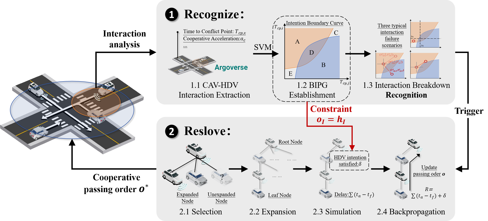

## Interact, Instruct to Improve: A LLM-Driven Parallel Actor-Reasoner Framework for Enhancing Autonomous Vehicles Interactions

### [Shiyu Fang](https://fangshiyuu.github.io/)

## Abstract
Autonomous Vehicles (AVs) have entered the commercialization stage, but their limited ability to interact and express intentions still poses challenges in interactions with Human-driven Vehicles (HVs). Recent advances in large language models (LLMs) enable bidirectional human-machine communication, but the conflict between slow inference speed and the need for real-time decision-making challenges practical deployment.
To address these issues, this paper introduces a parallel Actor-Reasoner framework designed to enable explicit bidirectional AV-HV interactions across multiple scenarios. First, by facilitating interactions between the LLM-driven Reasoner and heterogeneous simulated HVs during training, an interaction memory database, referred to as the Actor, is established. Then, by introducing the memory partition module and the two-layer memory retrieval module, the Actor's ability to handle heterogeneous HVs is significantly enhanced. Ablation studies and comparisons with other decision-making methods demonstrate that the proposed Actor-Reasoner framework significantly improves safety and efficiency. Finally, with the combination of the eHMI display information derived from Reasoner’s reasoning and the feasible action solutions retrieved from the Actor, the effectiveness of the proposed Actor-Reasoner is confirmed in multi-scenario field interactions.

## Methodology overview
Complex and dynamic driving interactions place high demands on the real-time performance and interpretability of AV decision-making. Additionally, the heterogeneity of agents and the diversity of scenarios further amplify these challenges. To address these issues, this paper proposes an LLM-driven Actor-Reasoner framework, which combines fast system retrieval with slow system reasoning to enable effective driving interactions tailored to heterogeneous HVs and diverse scenarios.

The above figure depicts the overall framework of the proposed Actor-Reasoner architecture. This architecture draws on two cognitive modes from behavioral science theory when thinking: intuitive fast reactions and deliberate slow reasoning \citep{christakopoulou2024agentsthinkingfastslow, kahneman2011thinking}. That is, in real-world decision-making, the human brain alternates between instinctively generating quick actions based on experience and formulating well-thought-out strategies after careful consideration. Building on this concept, a parallel framework comprising an LLM-based fast system and a Two-layer Memory Retrieval-based (TMemR-based) slow system is designed. This architecture enables the identification of heterogeneous driver styles, the design of eHMI display information, and the rapid generation of AV decisions during driving interactions.

In addition to the Actor-Reasoner architecture, the proposed framework incorporates a heterogeneous driver reproduction module and an environment module. During the training phase, a non-cooperative Bayesian game is utilized to model the decision-making processes of heterogeneous HVs, which are subsequently simulated for interaction within a virtual simulative environment. In the testing phase, experiments are carried out in a real-world test field, where HVs are manually operated by experienced drivers.

This project is still under development, and we present some experimental results here. In the system, human drivers can express their intentions through voice, which are then processed by a fast-slow system built with an LLM and an external database (referred to as the Talker-Reasoner). This system outputs CAV behavior (at 10 Hz) and eHMI information accordingly.

  <video muted controls width="500" style="margin-right: 10px;">
    <source src="./src/case.mp4" type="video/mp4">
  </video>

In the video above, the CAV is driven by our designed Talker-Reasoner. Initially, the HDV is closer to the intersection, making it more likely to pass through first. However, the HDV driver subsequently expresses an intention to yield. Upon receiving this information, the CAV decides to take priority and accelerates to pass through the intersection.

Furthermore, the figure below demonstrates the dynamic changes in the CAV's eHMI during the interaction process. At the beginning of the interaction, the CAV expressed its intention to yield. However, after receiving the HDV's intention to yield, the CAV shifted its preference to take priority and communicated this intention through its eHMI.

