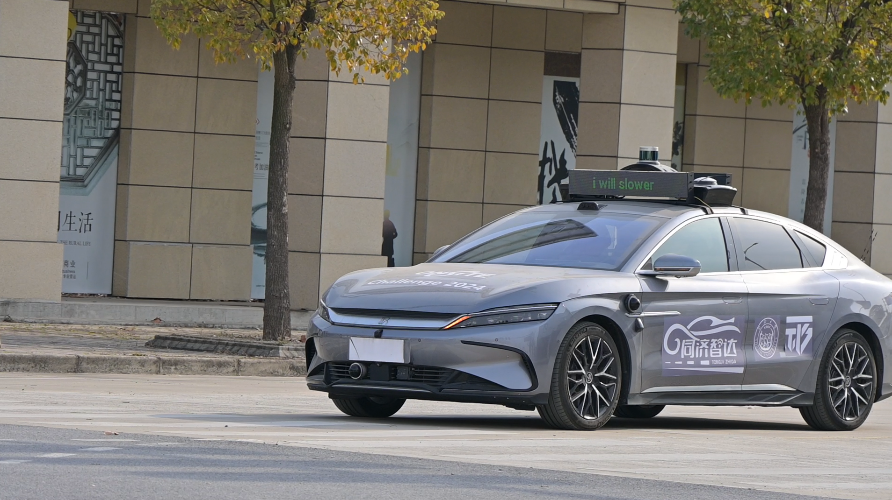
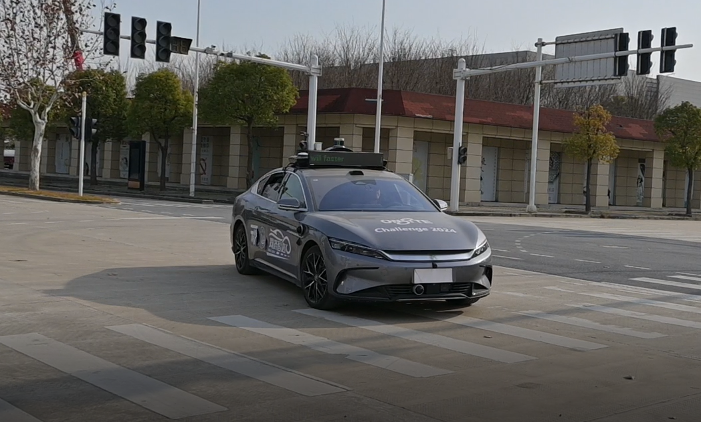

## Talker-Reasoner

### [Shiyu Fang](https://fangshiyuu.github.io/)

This project is still under development, and we present some experimental results here. In the system, human drivers can express their intentions through voice, which are then processed by a fast-slow system built with an LLM and an external database (referred to as the Talker-Reasoner). This system outputs CAV behavior (at 10 Hz) and eHMI information accordingly.

  <video muted controls width="500" style="margin-right: 10px;">
    <source src="./src/case.mp4" type="video/mp4">
  </video>

In the video above, the CAV is driven by our designed Talker-Reasoner. Initially, the HDV is closer to the intersection, making it more likely to pass through first. However, the HDV driver subsequently expresses an intention to yield. Upon receiving this information, the CAV decides to take priority and accelerates to pass through the intersection.

Furthermore, the figure below demonstrates the dynamic changes in the CAV's eHMI during the interaction process. At the beginning of the interaction, the CAV expressed its intention to yield. However, after receiving the HDV's intention to yield, the CAV shifted its preference to take priority and communicated this intention through its eHMI.

